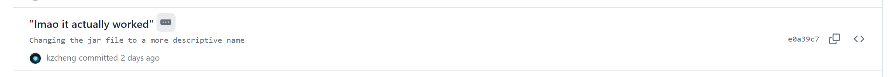

# CMPT276 Assignment 1
Assignment 1 of CMPT276 taught by Bobby Chan in 2024.

## Interactive Quiz Application
A small web app deployed on Render.com. HTML, CSS, and JavaScript will be used.

## Deploying Locally
1. Clone the repo.
2. Run the Java file in `src\main\java\cmpt276\kzcheng\asn1\Asn1Application.java`.
3. Install any dependencies needed if any are missing and try again.
4. Visit `http://localhost:9090/quizApp.html` to see the web app.

## Notes for Marking This
### Port ID
The port when deploying this project to `localhost` have been changed to `9090`. This is because `8080` is being used by another local LLM that have the port number be hardcoded in.

### Commits with Descriptions
Some commits may have more details in descriptions. Especially ones with more jokingly titles.

